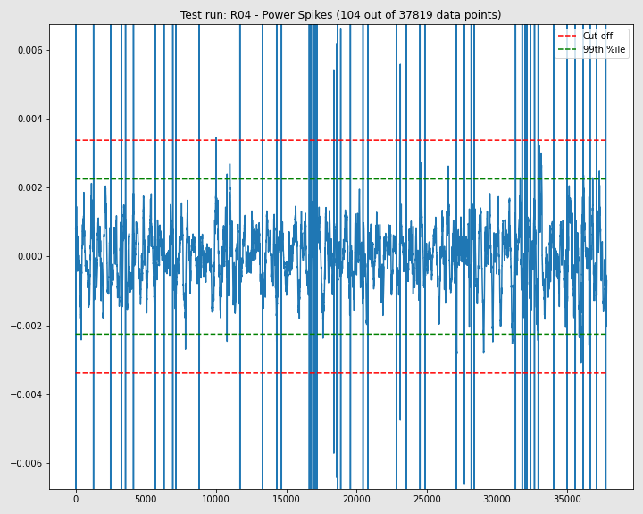

Various plots and data tables to help Validate data for all Test Runs  
### Data Records  
- [Missing Data Records](MissingDataRecs.html)  

#### Data Outliers  
- [AirSpeed-Peaks](AirSpeed-Peaks.html)
- [Cadence-Peaks](Cadence-Peaks.html)
- [CdA-Peaks](CdA-Peaks.html)
- [CrankAngularVelocity-Peaks](CrankAngularVelocity-Peaks.html)
- [Drag-Peaks](Drag-Peaks.html)
- [GroundSpeed-Peaks](GroundSpeed-Peaks.html)
- [Power-Peaks](Power-Peaks.html)
- [TotalWeight-Peaks](TotalWeight-Peaks.html)

#### Data Spikes  
- [Summary of Data Spikes](DataSpikes.html) 

#### Data Cleaned  

